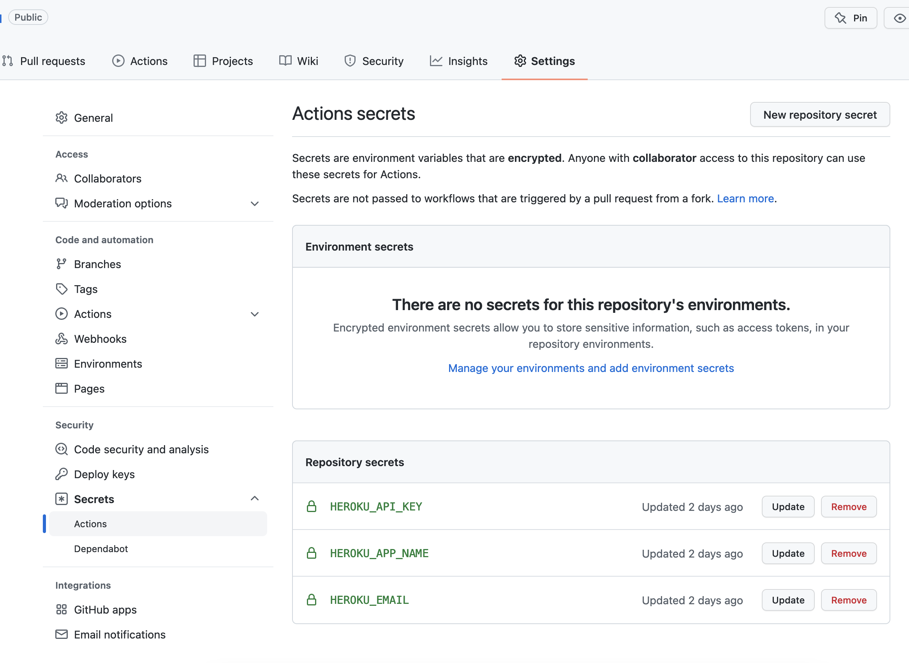
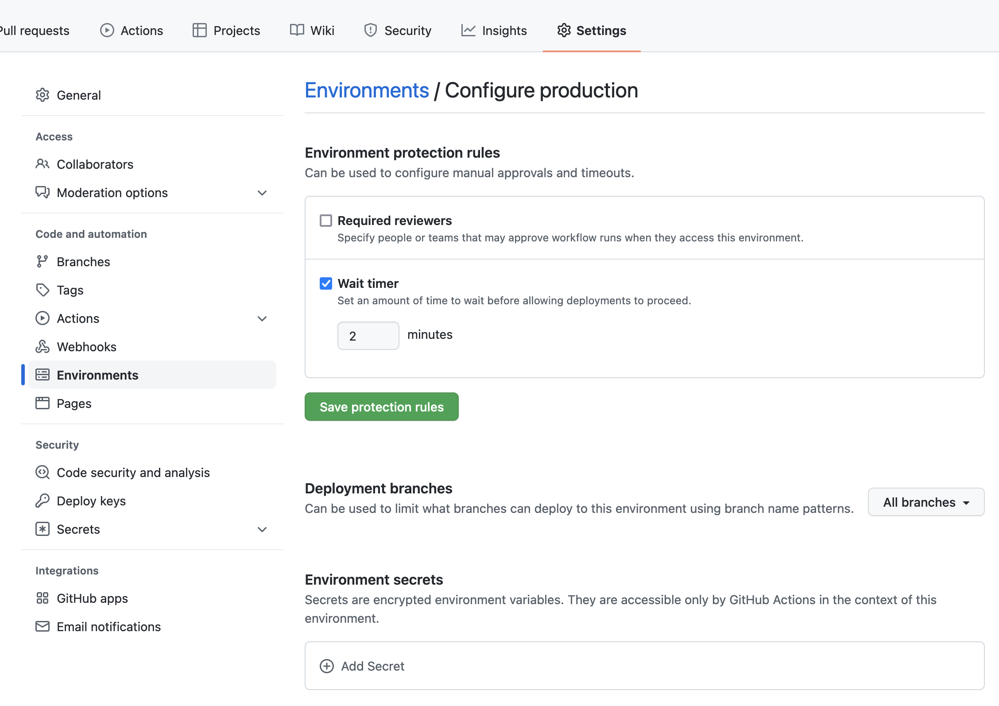

# gha-ts-heroku
Deploy typescript hello wolrd to heroku with github actions.

How to make github acitons work:

1. In github repository *Settings -> Secrets -> Actions* setup the `HEROKU_API_KEY`, `HEROKU_APP_NAME` and `HEROKU_EMAIL` for deploying the application to heroku 

1. For running main.yml, setup *Settings -> Environment* by adding the environment `production` with `Environment protection rules` as you like 

